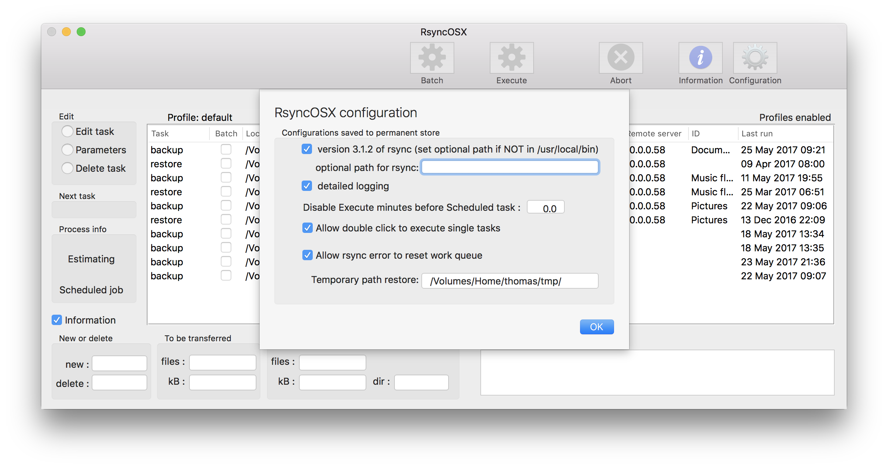

## The main opening view

Make **sure** you have read the [important](docs/HowtoUseRsyncOSX.md) info before start using RsyncOSX (and rsync).

All configurations to execute are listed in table. From this screen all actions (edit configurations, adding parameters to rsync, delete configurations) regarding configurations are executed.

There are two labels on top of table : **Profile** and **Double click: YES**. Configurations can be saved in user selected profiles. The profile in use is shown in label `Profile : name`. `Double click:YES` (or NO) either allow or don't allow executing single tasks by double click on row. Disable or enable in Configuration.

**Important**: Information about *new:* and *delete:* files and remote number of directories are only available if version 3.x of rsync is used.

The red rows indicates no connection to remote server. RsyncOSX does a **background** check (informal only) for remote servers at startup. The server `10.0.0.58` is a local NAS server and RsyncOSX does not find `10.0.0.58` outside my home and marks configurations red in table view.

From version 4.4.6 the background check for TCP-connections is removed as an automatic check. Pressing the TCP-button executes the check and marks configurations not available (no contact wit remote server) red.

A double click on a row executes the task. A drop down view presents result of task after rsync terminates. A backup is normally a two step task, first a `--dry-run` and then the real task. Tasks might be marked for batch for execution in one go (all tasks marked for batch).

### Profiles

RsyncOSX uses profiles. If not used all configurations are saved in the default profile. Which profile in use is labeled on left top of table.

**Double click** on a profile name to select a profile.

In the profiles menu there are two options:

- `New` profile. Name of new profile must be set in `New profile name` before `New` button is selected.
- `Delete` profile. Select profile to be deleted in list of profiles and select `Delete` button to delete.

Selecting the `Default` button selects the default profile.

### Logging

RsyncOSX is logging all tasks. The user can choose in user configuration, to disable or enable detailed logging. Detailed logging is on as default. In log view all tasks with date, number of files and size transferred is logged. In the main view date and time for last execution is set.

## RsyncOSX configuration files

RsyncOSX configuration file, scheduled tasks which also includes log records and user configuration are plain XML-files ([property list files](https://en.wikipedia.org/wiki/Property_list)). Files are saved in:

- `~/Documents/Rsync/MacID/configRsync.plist` - configurations
  - `~/` is user home directory
  - `MacID` is the Mac serial number and is automatically set by RsyncOSX
- `~/Documents/Rsync/MacID/scheduleRsync.plist` - scheduled tasks including log records
- `~/Documents/Rsync/MacID/config.plist` - user config

If _profile_ is used:

- `~/Documents/Rsync/MacID/profile/configRsync.plist`
- `~/Documents/Rsync/MacID/profile/scheduleRsync.plist`
  - `profile` is the profile name
- `~/Documents/Rsync/MacID/config.plist` - user config

## Rsync errors

Sometimes rsync throws errors. RsyncOSX does a simple check in output if there are any occurrence of the prashe `rsync error:`. If found RsyncOSX resets the work queue. This is *not* a advanced error handling.

