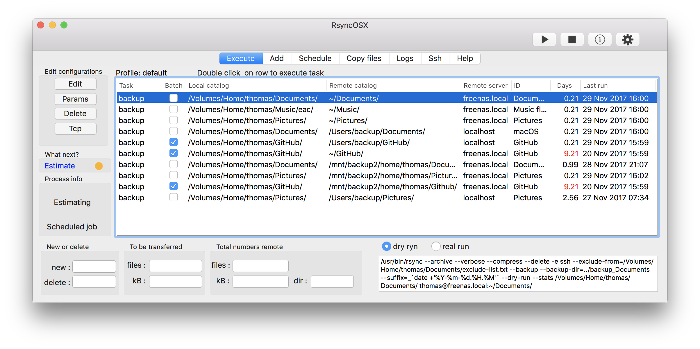
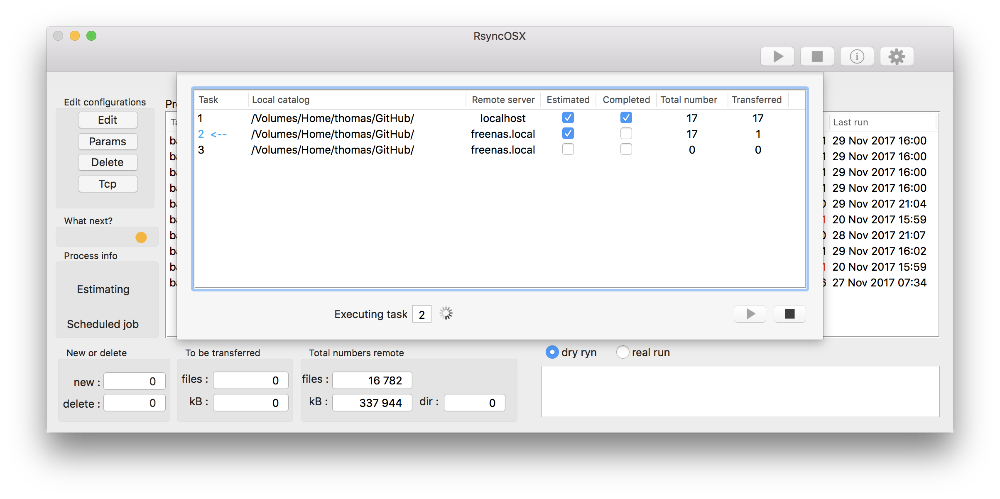
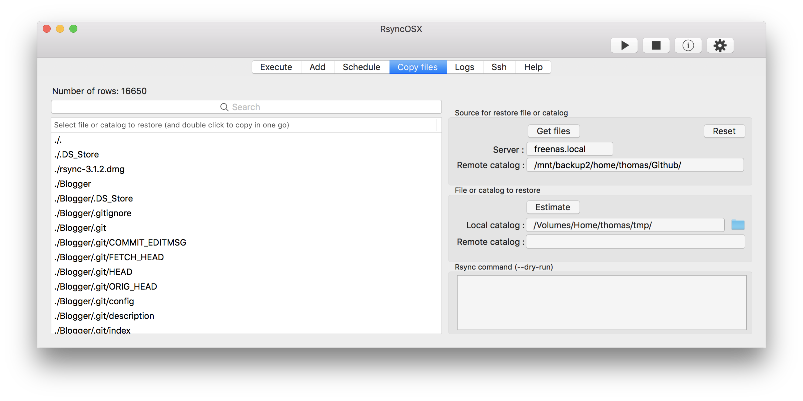
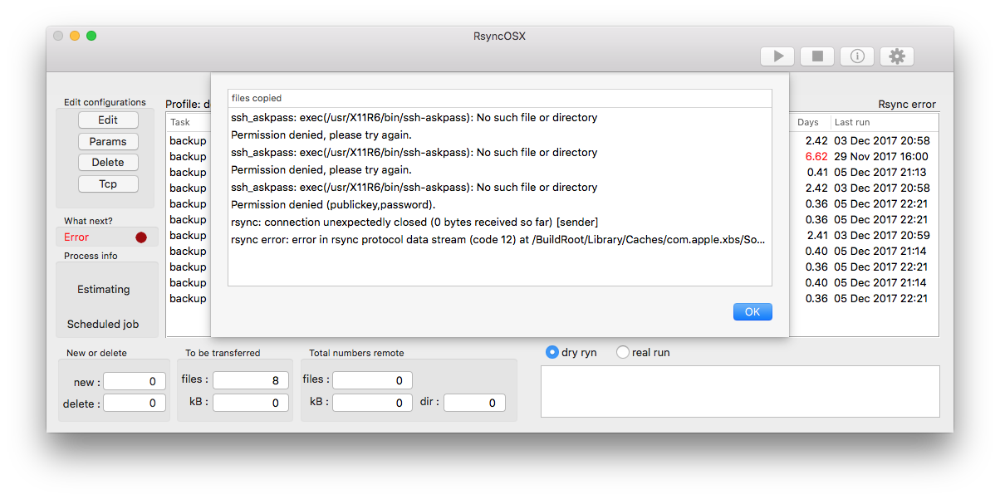
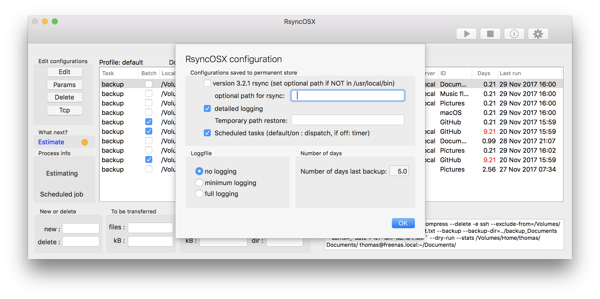
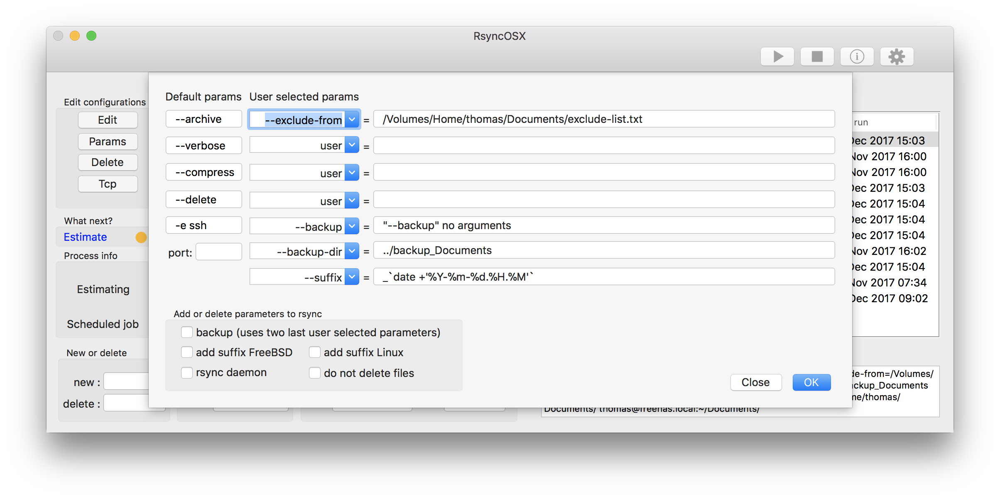

## The main opening view and a short intro to RsyncOSX

This page is a short intro to RsyncoSX and a brief walkthrough of the main functions of RsyncOSX. The intro is based on functionality in *version 4.9.1* of RsyncOSX. Some of the screenshots are previous versions. For more details about the various functions of RsyncOSX please see the documentation about each function. Make sure you understand the basics about how rsync works before using RsyncOSX (and rsync).
```
Warning: default parameters for rsync is to synchronize the source and destination.
A "restore" will delete all files in the source which are not in the destination.
The main objective to RsyncOSX is to keep source directory and destination (backup)
directory synchronized. When a source directory is backed up, the destination is 100%
synchronized with the source in the moment the backup task is completed. There are
no revisions of files in the backup in default RsyncOSX. Old files in the backup are
either replaced with new ones or deleted if so is true in source.
```
If you want to save old or deleted files in the destination (the backup) there is a predefined parameter in user selected [parameters](Parameters.md).

All configurations to execute are listed in table. From the main view most actions (edit configurations, adding parameters to rsync, delete configurations) regarding configurations are executed. Configurations can be saved in user selected **profiles**. The **profile** in use is shown in label `Profile: name`. **Information** about *new:*, *delete:* files and *remote number* of directories are only available if version 3.x of rsync is used.

## How to execute tasks

There are four ways to execute tasks (`backup` tasks only). Due to how a `restore` works a restore can only be executed by a test run (`--dry-run`) before the real run. This is a precaution (see warning above).
- a double click on a row executes first a test run (`--dry-run`), the next double click executes the real task
  - selecting another row after a `--dry-run` resets the work queue
- `⌘R` - shortcut for immediate execute task after selecting a row
  - if a task is executed by shortcut `⌘R`, a select of another row during execution will terminate (abort) the current task
  - this is only available in version 4.9.2 (released as a rc)
- mark backup tasks for batch, select the batch button executes all tasks marked for batch in one go
- schedule a task, scheduled tasks are executed according to date and time, ether once, daily or weekly

All tasks can be aborted during execution.

## Executing single tasks
The <span style="color:red">red rows</span> indicates no connection to remote server. Selecting the TCP-button executes the check and marks configurations not available (no contact with remote server) red. RsyncOSX does a **background** check (informal only) for remote servers. The server `freenas.local` is a local NAS server (FreeNAS) and RsyncOSX does not find `freenas.local` outside my home and marks configurations red in table view.

Selecting the row indicates a estimate run is next. A **double click** on row executes the task. Next task is a *Estimate* run as indicated on left in main view. An estimate run is a `--dry-run` execution of rsync. Tasks can also be executed in one go by selecting the batch button

The result of a estimate run is presented. Next task is *Execute*. Execute is the real run as indicated on left side in main view RsyncOSX. Selecting a new row resets the tasks. The number of files and size of all files is shown in bottom of view. During a real run a progress bar show the progress of backup or restore task. All tasks can be aborted during execution.

See [single task](SingleTask.md) for more info.

### Batch mode

Tasks can be executed in one go in batch mode.

See [batch task](BatchTask.md) for more info.

## Adding configurations

It is easy to add new tasks. RsyncOSX adds both the backup and restore part of task automatically.

See [add configurations](AddConfigurations.md) for more info.

## Scheduling tasks

Only **backup** tasks can be scheduled. When a task is scheduled RsyncOSX counts down when task is kicked off. The first scheduled task to be executed is marked green in table and the column `In` shows when task is due for execution.

See [schedules](ScheduleTasks.md) for more info.

## Copy files

Files and directories can be restored from remote servers. It is easy to search for files or directories to restore.

See [copy files](CopySingleFiles.md) for more info.

## Logging

RsyncOSX is logging all tasks. The user can choose in user configuration, to disable or enable detailed logging. Detailed logging is on as default. In log view all tasks with date, number of files and size transferred is logged. In the main view only date and time for last execution is set.

See [logging](Logging.md) for more info.

## Ssh

Setting up password less logins is required to backup files to remote servers. RsyncoSX can assist in setting up password less logins.

See [ssh](ssh.md) for more info.

## Rsync errors

Sometimes rsync throws errors. RsyncOSX does a simple check in output if there are any occurrence of the words `rsync error:`. If found RsyncOSX resets the work queue. This is *not* an advanced error handling.


## User configurations

Some configurations can be set on or off by the user.

See [user configuration](UserConfiguration.md) for more info.

## Rsync parameters

The user can pass any parameter to rsync or choose some predefined parameters.

See [rsync parameters](Parameters.md) for more info about user selected parameters and [default parameters](RsyncParameters.md) about default parameters.

## Profiles

RsyncOSX uses profiles. If not used all configurations are saved in the default profile. Which profile in use is labeled on left top of table.

**Double click** on a profile name to select a profile.

In the profiles menu there are two options:

- `OK`. Name of new profile must be set in `New profile name` before `OK` button is selected. If `New profile name` is empty the view is closed (not loading a new profile).
- `Delete` profile. Select profile to be deleted in list of profiles and select `Delete` button to delete.
- `Default` button selects the default profile.


### RsyncOSX configuration files

RsyncOSX configuration file, scheduled tasks which also includes log records and user configuration are plain XML-files ([property list files](https://en.wikipedia.org/wiki/Property_list)). Files are saved in:

- `~/Documents/Rsync/MacID/configRsync.plist` - configurations
  - `~/` is user home directory
  - `MacID` is the Mac serial number and is automatically set by RsyncOSX
- `~/Documents/Rsync/MacID/scheduleRsync.plist` - scheduled tasks including log records
- `~/Documents/Rsync/MacID/config.plist` - user config

If _profile_ is used:

- `~/Documents/Rsync/MacID/profile/configRsync.plist`
- `~/Documents/Rsync/MacID/profile/scheduleRsync.plist`
  - `profile` is the profile name
- `~/Documents/Rsync/MacID/config.plist` - user config
