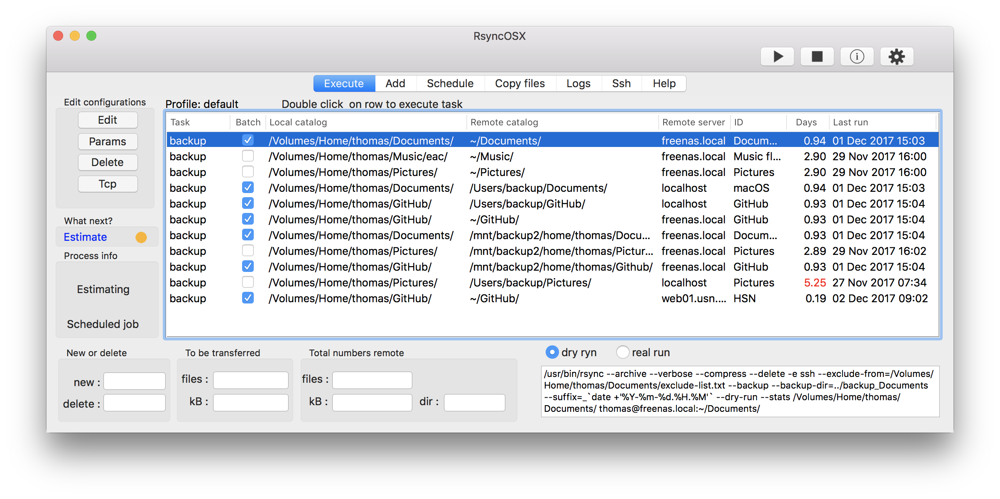
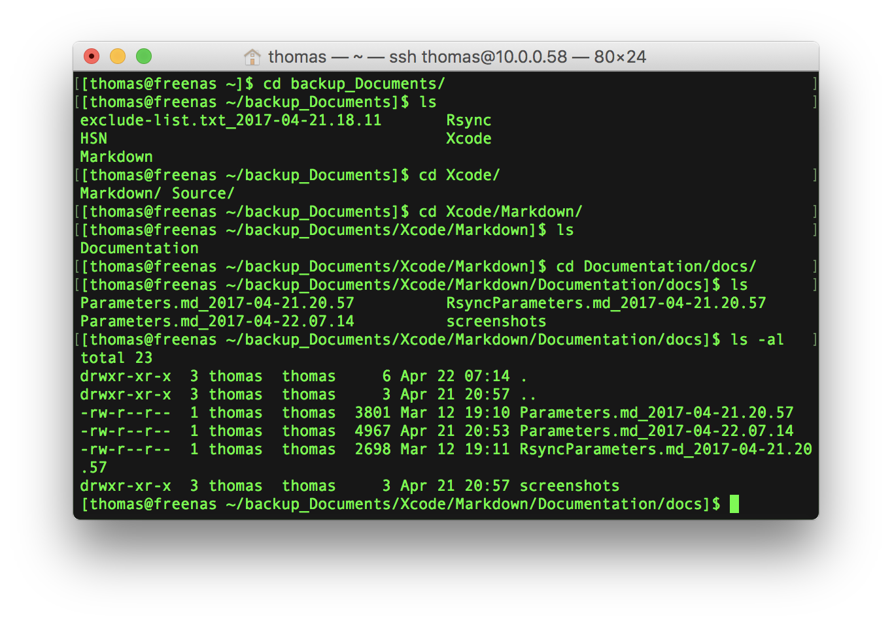
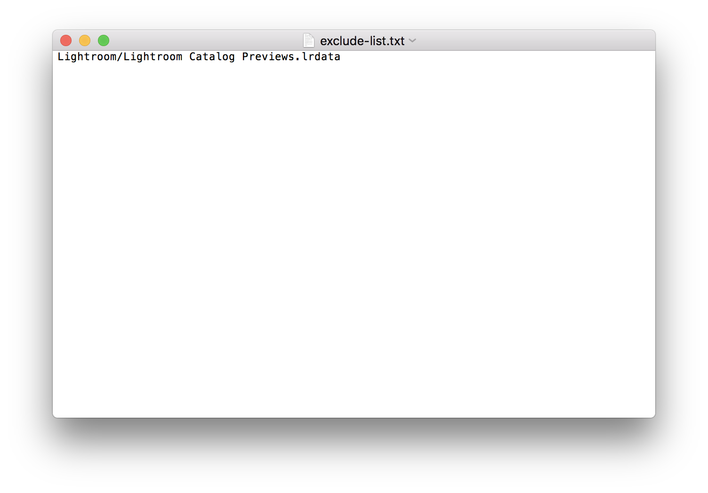

## Parameters to rsync

Index of [RsyncOSX documentation](https://rsyncosx.github.io/Documentation/).

The parameters in picture (below) instructs rsync to save changed files in catalog `../backup` (relativ to destination catalog) and **suffix** the backup file with timestamps. The above is enabled or disabled by select the `backup` button. The user might change the backup catalog. The backup catalog can either be absolute path or relative path. Default backup catalog is `../backup`.

See also the [standard parameters](https://github.com/rsyncOSX/Documentation/blob/master/docs/RsyncParameters.md) to rsync.

## Details about the sample parameters

The website LibreByte has written an article [14 Pratical examples of the rsync command](http://www.librebyte.net/en/gnulinux/14-practical-examples-of-the-rsync-command/). One of the examples is instructing rsync to store backups of files in a backup folder and rename old files by a date suffix.

Rsync utilises a ton of parameters. RsyncOSX has only presented a few. Parameters are normally constructed as:

- `--parameter=value` 
	- sample `--exclude-from=/Volumes/Users/thomas/Documents/exclude-list.txt`
- `--parameter` 
	- sample `--stats`, `--dry-run`

## RsyncOSX passing userselected parameters to rsync

The user can set own parameters by using `user` in dropdown menu. Preset parameters are:

- `user` - _user selected_ parameter
	- RsyncOSX passes whatever set by user to rsync, parameters must be either `--parameter=value` or `--parameter`
- `--stats` - produces some more statistics
	- parameter is forced on in dry-ryn to collect info about run
- `--backup` - instructs rsync to backup changed files
- `--backup-dir` - where to store changed or deleted files before rsync syncronise source and destination
- `--exclude-from` - path to file which stores file patterns to **exclude** from rsync backup
- `--include-from` - path to file which store file patterns to **include** from rsync backup 
- `--files-from` - path to file which store what to backup
- `--max-size` - set max size of files to backup
	- sample `--max-size=5MB` , files with size bigger than 5 megabyte (MB) are omitted
- `--suffix` - set suffix on files, suffix can be set on files together with the `--backup`parameter. One suffix might rename files which are either deleted or replaced newer files with a trailing date and time stamp.
	- sample <code>--suffix= _\`date +'%Y-%m-%d.%H.%M'`</code> see last picture for result
	- I have experienced some variations regarding the suffix. If you want to use suffix you might try an alternative suffix if the above is not working as expected. If so is true use `--suffix= _$(date +%Y-%m-%d.%H.%M)` instead. You just have to try and see what works 
- `delete` - delete the parameter
	- deletes the parameter when `OK` button is selected
	- or just delete the `value` string

## Sample backup of my 5GB Documents catalog

I am doing regular backups of my Documents catalog. The source code for RsyncOSX is stored in the Documents catalog and `git` is creating a `.git` directory in all catalogs where git is used. I want rsync not to transfer the `.git` directories and `.DS_Store` files created by MacOS.

Selecting the `backup` option and `suffix` for FreeBSD sets the three last parameters. The backup directory, which is saving all versions of changed and deleted files, is set to `../backup` + `_Document` catalog as preselected value. 

The `exclude-list.txt` file includes the two lines below to omit all `.git` directories and `.DS_Store` files.

If the backup directory is not created rsync automatically creates it. The `../backup_Documents` is a catalog relative to the destination catalog. The user can specify any catalog as backup catalog.

The screen below is a listing of some of files moved to the backup directory and renamed before new files are transferred from source to destination.

## Sample backup of my 100GB Picture catalog

I am using RsyncOSX to backup my Pictures catalog - about 100GB of raw picture files. I am also using Adobe Lightroom for organising my Pictures. Adobe Lightroom creates preview of pictures in `Lightroom/Lightroom Catalog Previews.lrdata` catalog. I do not want to backup any previews, only the picture files, Lightroom settings and Lightroom library catalog. 

- create a .txt file with the following line `Lightroom/Lightroom Catalog Previews.lrdata`, save the file with name `exclude-list.txt` in the `Pictures` catalog
- pass the following parameter `--exclude-from=/Volumes/Users/thomas/Pictures/exclude-list.txt` to rsync from the parameter view within RsyncOSX

And that is it. Rsync excludes whatever found in the `--exclude-from` file (including file patterns).

