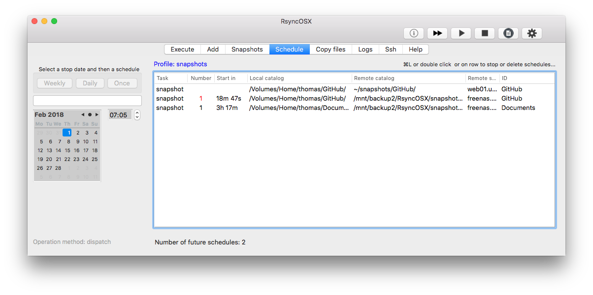
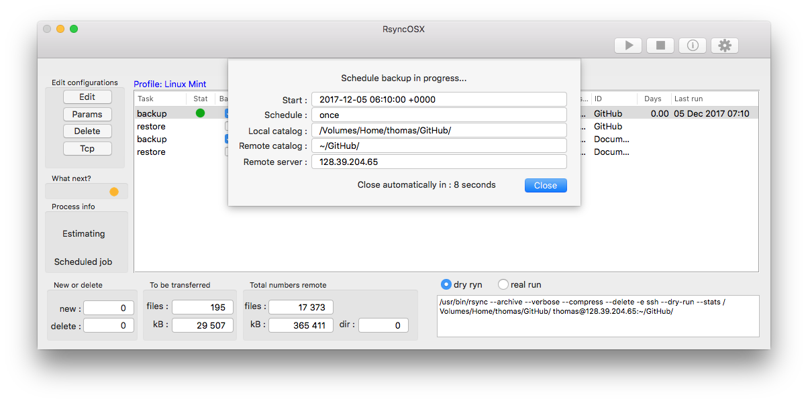

## Schedule task

By selecting a row and choose schedule applies a scheduled backup to a task. There are four(three) choices for schedules :

- Once
	- is executed _once_ at date and time given
- Daily
	- is executed _every 24-hour_ and stops at given date and time
first backup starts in 24-hour
- Weekly
	- as for daily, but _every 7 day_
- Details
	- stop or delete scheduled tasks

Select task (row), set the start date and time and select the schedule (once, daily or weekly) to set up a schedule of backup. Every time RsyncOSX starts, the schedule is computed. Every time a change in any schedule the schedule is computed. The schedule is a stack of tasks. The top most element is the first task to be executed. RsyncOSX keeps track of the first task only (in time). Rest of the scheduled operations remains on stack until popped of the stack.

The stack is a reference only to a configuration (by a hidden key). The user can change anything regarding the task up to the moment the task is executed by schedule. If the task is deleted RsyncOSX cancel the schedule, computes the stack again and starts tracing in time next scheduled task.

When the first scheduled task is _completed_, RsyncOSX checks the next top element of stack. If start date and time is in the future RsyncOSX tracks task in time. 

Schedule _daily_ is selected. First scheduled backup is in about 24 hours and next after that is in two days.

RsyncOSX gets info about remote sever and local path. In the Execute view a number behind task displays how many times task will be executed by schedule.

### Stopping a scheduled task

Select row and then **details**. Either stop or delete task. If a task is deleted all logs regarding the task is deleted. The number `Logs` is how many log items there are in each schedule. Schedule with starddate `01 Jan 1900 00:00` is manually executed tasks.

