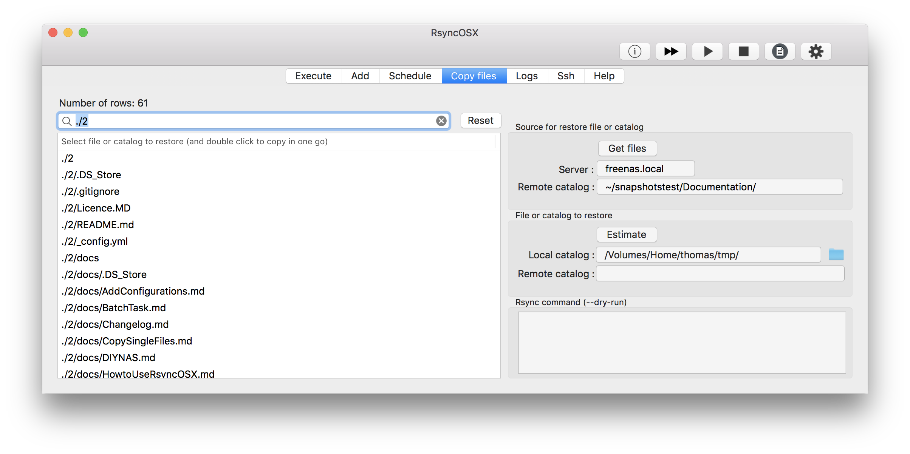

## Snapshots

Index of [RsyncOSX documentation](https://rsyncosx.github.io/Documentation/).

There are a few important notes about the snapshot functionality:

- the snapshot functionality within RsyncOSX is in beta, use copy files function for restore of single files or catalogs, snapshot works on attached disks (localhost) and remote hosts
- snapshot is work in progress and for the moment, function for administration of snapshots is yet not implemented
- standard rsync sync tasks (backup tasks) cannot be *converted* to snapshots, creating snapshots starts with a full sync in the first snapshot catalog (`~/snapshots/Documents/1`)
- the snapshot feature utilizes the `--link-dest` parameter,  [version 3.1.2](https://download.samba.org/pub/rsync/src/rsync-3.1.2-NEWS) of rsync fixed a bug regarding the parameter.
  - it is recommended utilizing [version 3.1.2](https://download.samba.org/pub/rsync/src/rsync-3.1.2-NEWS) or the coming [version 3.1.3](https://download.samba.org/pub/rsync/src-previews/rsync-3.1.3pre1-NEWS) if using the snapshot feature of RsyncOSX

## How does the snapshots works?

Every snapshot is in sync with local catalog at the time of creating the snapshot. Previous versions of files can be restored from snapshots. The snapshot is by utilizing the `--link-dest` parameter of rsync. The parameters for snapshot are:
`--link-dest=~/snapshots/Documents/n-1 /Volumes/Home/thomas/Documents/ thomas@freenas.local:~/snapshots/Documents/n` where **n** is the number of snapshots.

The source catalog (`/Volumes/Home/thomas/Documents/`) is **never** touched, only read by rsync.

Executing snapshots as for standard backup (synchronize) tasks. The snapshot is like:

The local catalog (Documents catalog as sample catalog):

- `/Volume/home/thomas/Documents/`

The snapshot catalogs:

- `~/snapshots/Documents/1` - snapshot 1
  - a full sync when snapshot is created
- `~/snapshots/Documents/2` - snapshot 2
- .....
- `~/snapshots/Documents/N` - snapshot n
  - n is the latest snapshot

In the sample above the remote catalog `~/snapshots/Documents` is decided to be the root of snapshots.

### Create a snapshot task

Select the snapshots in optional parameters to utilize snapshots. Only the backup part is created utilizing snapshots.

### Ready for next snapshot

The rsync command shows the command to be executed. Important: **do not** copy and paste command for execution within a terminal window. RsyncOSX does some required housekeeping after execution of a snapshot task. 

### Snapshots on server

The terminal view shows there are two catalogs for snapshots on server.

## Logs, search and restore

I have not yet design a search and restore special for snapshots. By using the copy files functionality single files or catalogs can be restored from snapshots. Logs are marked with snapshot number.

Filter all files in snapshot #2.

